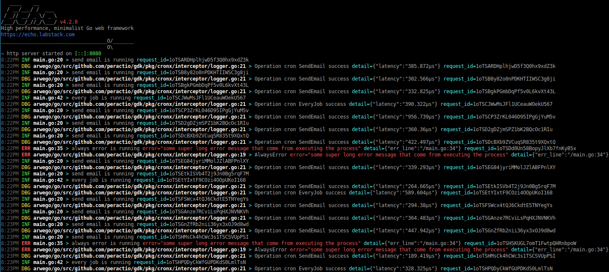

[](https://pkg.go.dev/github.com/rizalgowandy/gdk?tab=doc)
[](https://github.com/rizalgowandy/gdk/releases)
[](https://goreportcard.com/report/github.com/rizalgowandy/gdk)
[](https://github.com/rizalgowandy/gdk/actions?query=branch%3Amain)
[](https://sourcegraph.com/github.com/rizalgowandy/gdk?badge)
[](https://www.tickgit.com/browse?repo=github.com/rizalgowandy/gdk)


## Getting Started

A collection of libraries to speed your Go development.

## Installation

```shell
go get -v github.com/rizalgowandy/gdk
```

## Examples

### Cronx


### Logx


